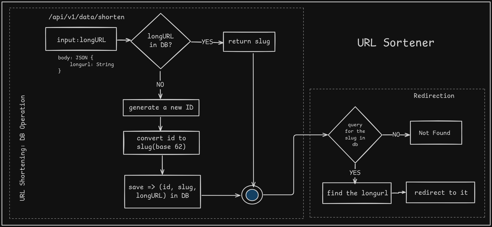

# URL Shortner

### Back of the Envelope Estimation

Let's assume,
- write operation: 100 millions urls are generated per day.
- write operation per second: `100 millions / (24 * 3600) = 1158 (approx) ~ 1160`
- Read operation: Read to write operation `10:1`
- Read operation per second: `11600`
- The service will run for 10 years: `100 millions * 365 * 10 = 365 billions (approx)` record must support
- Total storage require: `365 billions * 100 bytes = 365 TB` if each url is `100 bytes` long

---

### Architecture

---

### TODO

- **Add Redis caching**
    - [ ] Cache slug -> longurl
    - [ ] Cache expiry (e.g., 24 hours)
    - [ ] Write-through logic

- **Add stats endpoint**
    - [ ] GET /api/v1/stats/{slug}
    - [ ] Return:
        - created_at
        - click count
        - last_accessed
        - longurl

- **Redis (For rate limiting)**
    - [ ] Prevent spam on /shorten endpoint.
    - [ ] Or write basic Middleware for rate limiting
    - [ ] Check for aws options too for DDOS and rate limiting

- **Add logging or click tracking**
    - For click tracking use 302 redirecting

- **Add S3 log export endpoint in case of AWS integration**

- **CI/CD Pipelining**

- **Dockerfile & docker-compose**
    - [ ] API container
    - [ ] Postgres
    - [ ] Redis
    - [ ] LocalStack (S3) if needed

- **Production**
    - [ ] Middleware for tracing / logging
    - [ ] Clean error handling
    - [ ] URL validation + normalization
    - [ ] CORS setup

- **Think of using Monitoring tools like Prometheus & Grafana**
