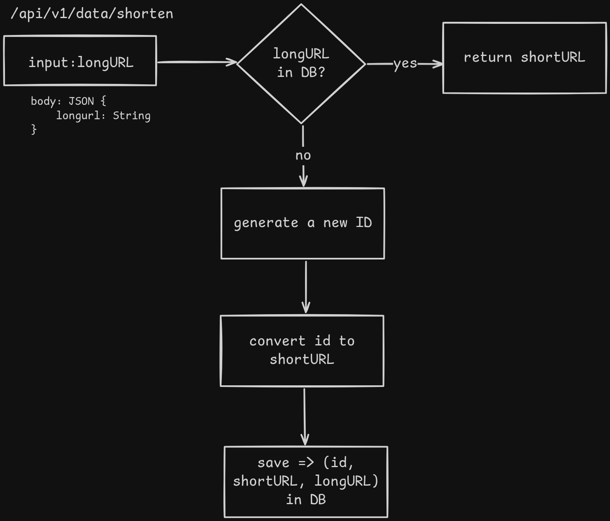

# URL Shortner

### Back of the Envelope Estimation

Let's assume,
- write operation: 100 millions urls are generated per day.
- write operation per second: `100 millions / (24 * 3600) = 1158 (approx) ~ 1160`
- Read operation: Read to write operation `10:1`
- Read operation per second: `11600`
- The service will run for 10 years: `100 millions * 365 * 10 = 365 billions (approx)` record must support
- Total storage require: `365 billions * 100 bytes` if each url is `100 bytes` long

---

### Architecture

